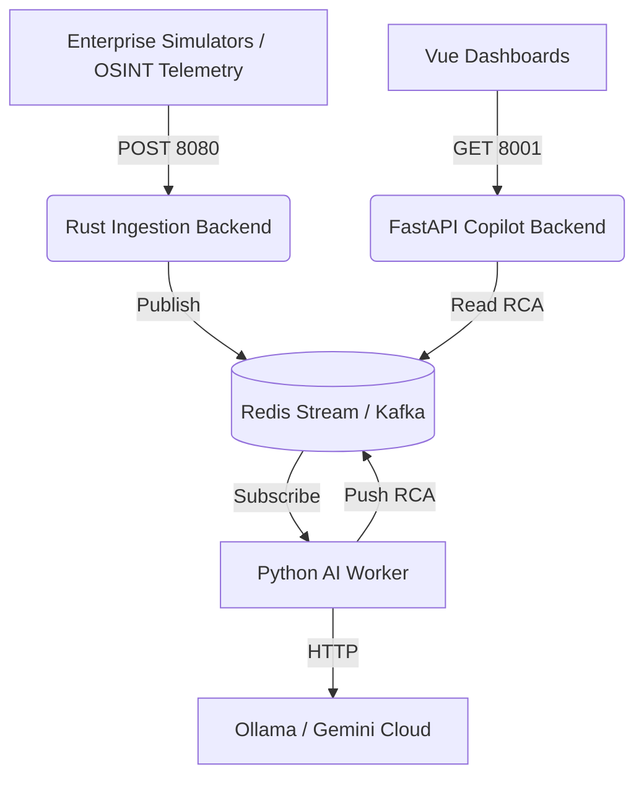

# MaintenanceAI 👁️

**MaintenanceAI** is a next-generation AI-powered Application Management Services (AMS) Copilot and Global OSINT telemetry dashboard. It acts as a hyper-intelligent Site Reliability Engineer (SRE), instantly ingesting millions of logs across distributed enterprise systems, dynamically visualizing active incidents, and generating real-time Root Cause Analysis (RCA) via generative AI models.


## 🌟 Key Features

1. **High-Throughput Rust Ingestion Engine**
   - Built on `Axum` and asynchronous Rust, the ingestion API handles OpenTelemetry (OTLP) Protobufs, AWS CloudWatch logs, Azure Monitor feeds, and generic webhooks, instantly normalizing them into a unified JSON format and publishing them to Redis Streams (or Kafka).
2. **Real-Time Generative RCA (Python AI Worker)**
   - A background Python daemon continuously tails the Redis log queue using a massive global rolling time-window buffer. 
   - When a crash or anomaly occurs, it gathers context across *disparate microservices* and dispatches it to Ollama or Gemini to generate a cascading "Event Timeline Analysis" identifying exactly how a failure in one service cascaded into another.
3. **Interactive AMS AI Dashboard (Vue 3)**
   - A fully responsive enterprise dashboard showcasing live log streams and critical service degradations.
   - Features a **Full-Screen AI Copilot** module (FastAPI powered) that allows SREs to chat directly with their logs and render generative data visualizations (AG-UI Protocol).
4. **Global OSINT Intelligence Dashboard**
   - An independent mapping application leveraging CartoDB DarkMatter that polls open-source global APIs (NASA FIRMS active fires, USGS Earthquakes, ADS-B Flight Transponders, SANS DShield).
   - **Cloud Vision Integration:** Intercepts live global CCTV feeds and processes them through the `qwen3-vl:235b-instruct` multimodal vision model to detect physical world anomalies (e.g., traffic congestion, accidents) and streams those alerts back into the central AMS AI Engine.
5. **Enterprise-Scale Simulators**
   - Bundled with powerful Python chaos-monkeys (`enterprise_simulator.py`) that mock a massive Amazon-scale architecture (Storefront, Payment Gateways, Fulfillment Kiva robots, Zero Ledger accounting) and randomly inject sophisticated deadlocks, network timeouts, and x509 certificate failures.

---

## 🏗️ Architecture Overview

The system is highly decoupled and composed of five main layers:



---

## 🚀 Quickstart (Docker)

The fastest way to experience MaintenanceAI is via the bundled multi-stage Docker container, which compiles the Rust server, the Vue frontend assets, and provisions the Python environment automatically.

### Prerequisites
- Docker & Docker Compose
- An API Key from [Ollama Cloud](https://ollama.com) (or a locally running LLM).

### 1. Configuration
Rename or copy `config.yaml.sample` to `config.yaml` in the root directory and securely insert your API keys.

### 2. Build & Run
From the repository root, run the bundled compose file:
```bash
docker-compose up --build -d
```

### 3. Access the Platforms
Once the container boots, it exposes the following distinct interfaces:
- **AMS SRE Dashboard:** [http://localhost:3001](http://localhost:3001)
- **Global OSINT Dashboard:** [http://localhost:3000](http://localhost:3000)
- **Copilot / Vision API (FastAPI):** [http://localhost:8001](http://localhost:8001)
- **Rust Ingestion API:** [http://localhost:8080](http://localhost:8080)

*(Note: Upon startup, the `enterprise_simulator` immediately begins firing mock traffic and injecting catastrophic system failures. Open the AMS Dashboard and watch the AI instantly deduce the root causes!)*

---

## 💻 Manual Setup & Development

If you wish to modify the code or run components natively:

### 1. The Rust Ingestion Server
```bash
# Ensure Redis is running locally on port 6379
cargo build
cargo run
```

### 2. The Python AI Worker & API
```bash
cd ai_worker
pip install -r requirements.txt
# Export your key for local shell dev
export OLLAMA_API_KEY="your-key"
# Start the background worker
python3 worker.py &
# Start the FastAPI Copilot backend
uvicorn api:app --host 0.0.0.0 --port 8001 &
```

### 3. Vue Dashboards
```bash
# Run the AMS Dashboard (Port 5174)
cd dashboard
npm install
npm run dev -- --port 5174

# Run the OSINT Dashboard (Port 5173)
cd ../osint_dashboard
npm install
npm run dev -- --port 5173
```

### 4. Trigger the Chaos
```bash
cd otel_simulator
pip install -r requirements.txt
python3 enterprise_simulator.py
```

---

## 🧠 Configuration Details

The central `config.yaml` governs the behavior of the AI heuristics:
- `queue.type`: Switch between `redis` or `kafka` buffering.
- `heuristics.context_window_size`: Determines how many chronological logs the AI sees prior to a crash (Default: 50).
- `heuristics.trigger_levels`: Which log severities immediately dispatch to the LLM (e.g., `ERROR`, `FATAL`).

## 🛡️ License
MIT License. See [LICENSE](LICENSE) for more details.
